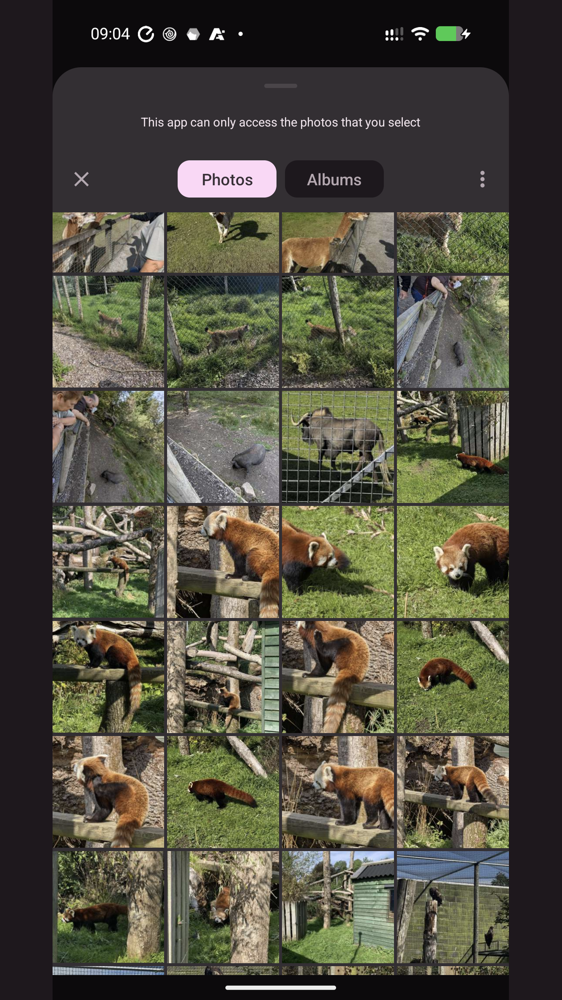
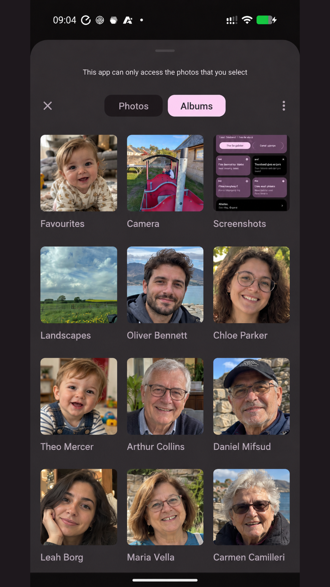
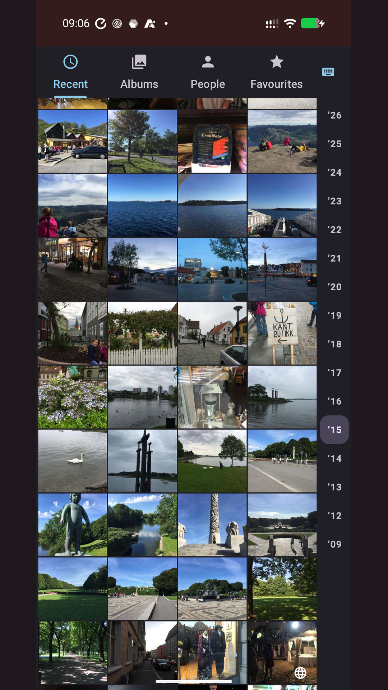

# NC Media Provider

Your Nextcloud photos and videos in Android's own photo picker.

> **Status:** in testing, not released yet. It will be published on Google Play and as GitHub releases. See [PLAN.md](PLAN.md) for the roadmap and the [issues](https://github.com/keithvassallomt/nc-media-provider/issues) for progress.

> [!NOTE]
>   
> This project voluntarily adheres to The Friendly Manifesto. Read more [here](https://friendlymanifesto.org)

  

## What it does

When an app asks you to choose a photo, Android opens its photo picker. The picker can show one cloud library next to the photos on your phone, and that's usually Google Photos. NC Media Provider puts your Nextcloud library there instead.

- Your Nextcloud photos and videos show in the picker of any app that uses it, mixed in with the phone's own, newest first.
- Your albums show too, including ones shared with you, and so do the people [Memories](https://github.com/pulsejet/memories) has recognised.
- A photo that's already on your phone shows once, and the phone's copy is used.
- Your library isn't copied to the phone. Thumbnails download as you scroll, and the full photo or video only when you pick it.
- Nothing on your server changes.

Some apps, such as Messenger, use their own photo grid instead of Android's picker. For those, **Send from Nextcloud** picks a photo and shares it into the app, and the optional **photo keyboard** lets you insert photos while you type.

## What you need

- A phone with Android 14 or newer.
- A Nextcloud server. [Memories](https://github.com/pulsejet/memories) and [Photos](https://github.com/nextcloud/photos) are optional, and add dates, albums and people.
- About ten minutes, once, for a setup step that uses [Shizuku](https://shizuku.rikka.app/) on the phone or a computer. **Root is never needed.**

## Quick start

1. Install NC Media Provider from [Google Play](https://play.google.com/store/apps/details?id=com.keithvassallo.ncmediaprovider), or download the APK from the [latest release](https://github.com/keithvassallomt/nc-media-provider/releases/latest).
2. Turn on Developer options: open **Settings > About phone** and tap **Build number** seven times.
3. Open the app and let Android trust it as a photo source, with Shizuku or with a computer (below). This is the only fiddly part, and you only do it once.
4. Sign in to your Nextcloud and choose your photo folders. The app walks you through it.

Then open the photo picker in any app: your Nextcloud photos are there.

### With Shizuku, on the phone

1. Install [Shizuku](https://play.google.com/store/apps/details?id=moe.shizuku.privileged.api) and start it: connect to Wi-Fi, turn on **Wireless debugging** in Developer options, pair Shizuku with the code Android shows, then tap **Start**.
2. In NC Media Provider, choose **On this phone, with Shizuku**, tap **Turn on with Shizuku**, and allow the app when Shizuku asks.
3. If the app says **Restart to finish** (GrapheneOS does), restart the phone, start Shizuku again and tap **Turn on with Shizuku** once more.

Step by step, with pictures: [setup guide, Shizuku](docs/setup-guide.md#shizuku).

### By hand, with a computer

1. Install adb on the computer: it comes with Android's [SDK Platform-Tools](https://developer.android.com/tools/releases/platform-tools).
2. Turn on **USB debugging** in Developer options, plug the phone in and allow the computer when the phone asks.
3. In NC Media Provider, choose **With a computer** and tap **Copy commands** (or **Send to my computer**). Paste them into a terminal on the computer.
4. Tap **I've run them, check**. On GrapheneOS, restart the phone after the commands, then run the last one again.

Step by step, with pictures: [setup guide, computer](docs/setup-guide.md#computer).

## Good to know

- Only one cloud source shows in the picker at a time. If you kept Google Photos as a choice, switch between the two under **Details and troubleshooting > Photo picker settings**.
- Each app update switches the app off in the picker. If Shizuku is running, the app switches itself back on. If not, a notification takes you there in one tap.
- To undo everything, use **Details and troubleshooting > Turn off with Shizuku**, or see [Undoing it](docs/setup-guide.md#undoing-it).

## Documentation

- [Setup guide](docs/setup-guide.md): everything above in detail, with pictures and troubleshooting.
- [How it works](docs/technical.md): the technical side, the activation commands, GrapheneOS, logs and building the app.
- [Privacy policy](docs/privacy.md)
- [All the docs](docs/)

## Help and bug reports

**Details and troubleshooting** in the app shows whether Android has the app selected, the last sync and any error. If something's wrong, tap **Share for a bug report** there: it builds a report with your server's address and user name masked out. Check it, then attach it to [a new issue](https://github.com/keithvassallomt/nc-media-provider/issues/new/choose).

## Privacy

The app talks only to your Nextcloud server. There are no ads, analytics or tracking. It signs in with Nextcloud's own login page, and signing out removes its password from your server. The full [privacy policy](docs/privacy.md) has the details.

## Credits

The Android provider layer started from [9dc/immich-media-picker](https://github.com/9dc/immich-media-picker) v0.4.2 (MIT), which does the same job for Immich. Its copyright notice is kept in [LICENSE](LICENSE).

## Disclaimer

NC Media Provider is not affiliated with or endorsed by Nextcloud GmbH. Nextcloud is a trademark of Nextcloud GmbH.

## License

[MIT](LICENSE)
