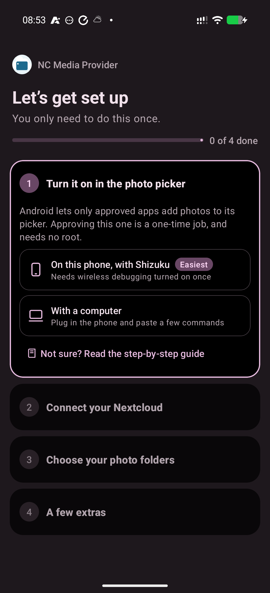
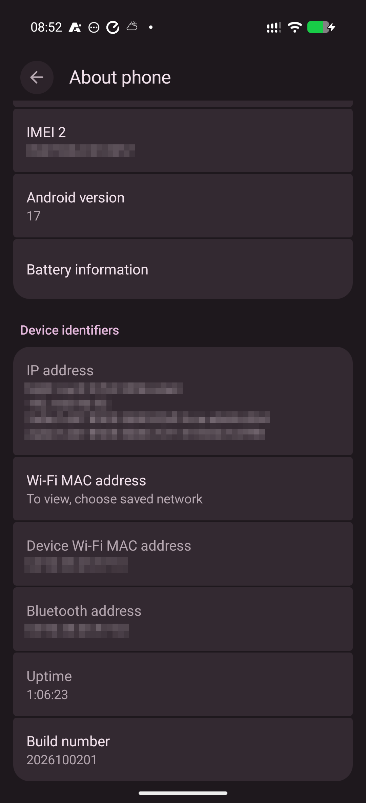
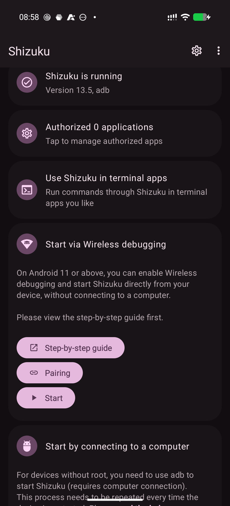
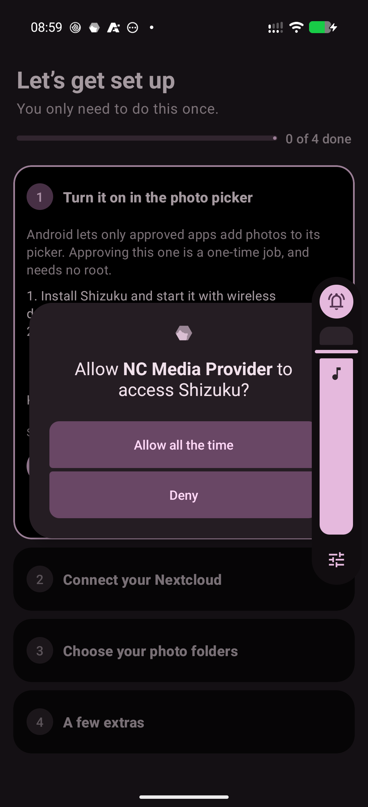
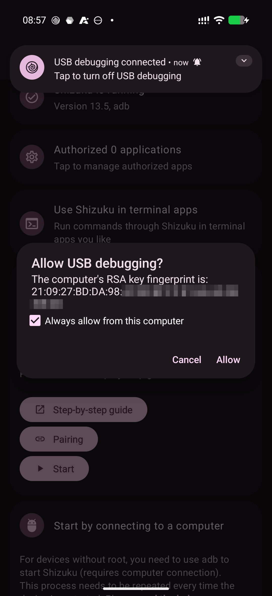
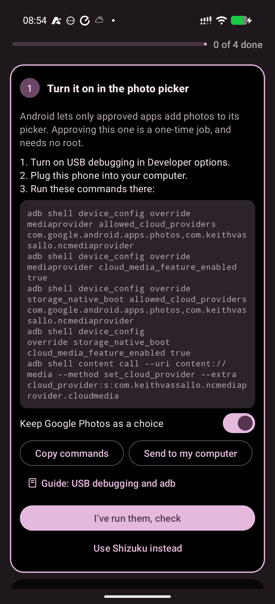
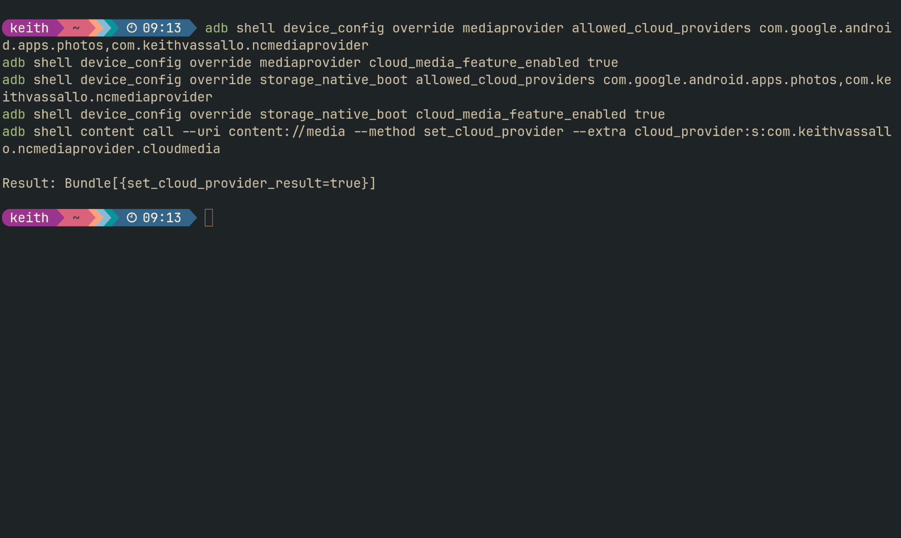
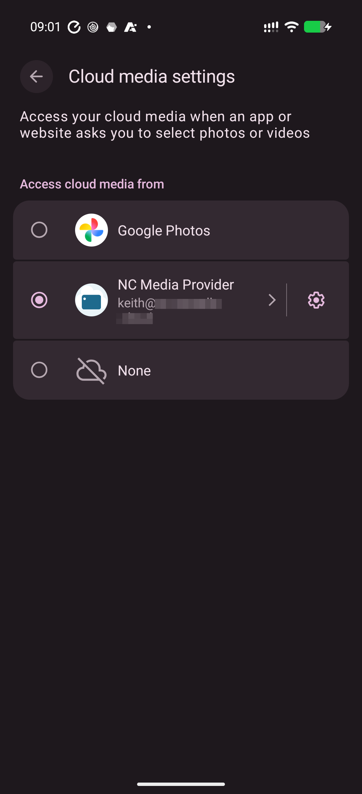
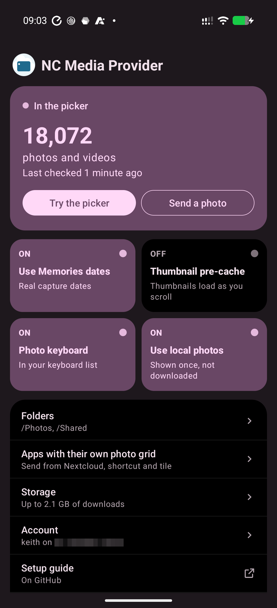

# Setup guide

NC Media Provider puts your Nextcloud photos and videos into Android's own photo picker, the screen that opens when an app asks you to choose a photo. This guide covers the one step that needs more than a few taps: letting Android trust the app as a photo source.

You need:

- a phone with Android 14 or newer;
- a Nextcloud server you can sign in to;
- about ten minutes, once.

No root is needed, and nothing on your Nextcloud server changes.

## Why this step is needed

Android only lets approved apps add photos to its picker. Out of the box that list holds Google Photos at most. Adding this app to it is a system setting that ordinary apps can't change by themselves, so you change it once, in one of two ways:

- **[With Shizuku](#shizuku)**, on the phone itself. This is the easiest way if you don't use a computer for this kind of thing.
- **[With a computer](#computer)**, by plugging the phone in and pasting a few commands.

Either way, the setting stays after a restart. Only one source can show in the picker at a time. If you keep Google Photos as a choice (the app's default), you can switch between the two in the picker's settings whenever you like.



## First: turn on Developer options

Both ways need Android's Developer options, which are hidden until you ask for them.

1. Open **Settings**, then **About phone**.
2. Tap **Build number** seven times. Android asks for your screen lock, then says you are now a developer.
3. Developer options now appear under **Settings > System > Developer options**.



## Shizuku

Shizuku is a free, open-source app that lets other apps use the same permissions a computer would have over USB, without root. It runs on the phone and is started with Android's wireless debugging, which needs Wi-Fi.

### 1. Install Shizuku

Install it from [Google Play](https://play.google.com/store/apps/details?id=moe.shizuku.privileged.api) or from [its website](https://shizuku.rikka.app/download/). The app's **Open Shizuku** button takes you there if it isn't installed yet.

### 2. Start Shizuku with wireless debugging

1. Connect the phone to Wi-Fi.
2. In **Developer options**, turn on **Wireless debugging** and confirm.
3. Open Shizuku. Under **Start via Wireless debugging**, tap **Pairing**. Shizuku shows a notification that waits for a code.
4. Back in **Developer options > Wireless debugging**, tap **Pair device with pairing code**. Android shows a six-digit code.
5. Type that code into Shizuku's notification (pull down the notification shade and tap **Enter pairing code**).
6. In Shizuku, tap **Start**. After a few seconds it says Shizuku is running.




Shizuku's own guide covers this in more detail, with pictures for each Android version: [shizuku.rikka.app/guide/setup](https://shizuku.rikka.app/guide/setup/).

### 3. Turn it on from NC Media Provider

1. Go back to NC Media Provider. In the first setup step, choose **On this phone, with Shizuku**.
2. Leave **Keep Google Photos as a choice** on, unless you want this app to be the only source.
3. Tap **Allow access** if the button says so, and allow NC Media Provider when Shizuku asks.
4. Tap **Turn on with Shizuku**.

On most phones the step ticks itself off: the app is approved and selected in the picker. Carry on with signing in.



**On GrapheneOS and some other phones** the picker's cloud sources only switch on when the phone starts. If the app says **Restart to finish**, restart the phone, start Shizuku again (step 2, without pairing this time), and tap **Turn on with Shizuku** once more.

### Do I need Shizuku again later?

Not for the photos to keep working. Every app update makes Android switch the app off in the picker, though. If Shizuku is running at that point, the app turns itself back on. If not, you get a notification, and one tap takes you to the picker's settings to select it again (see [Selecting the app in the picker](#selecting-the-app-in-the-picker)). You can turn Wireless debugging off whenever you like.

## Computer

This way uses `adb`, Android's command-line tool, from a computer with a USB cable.

### 1. Install adb

- **Windows:** download **SDK Platform-Tools for Windows** from [developer.android.com/tools/releases/platform-tools](https://developer.android.com/tools/releases/platform-tools), unzip it, and open a terminal (PowerShell) in the unzipped `platform-tools` folder. Type `.\adb` wherever this guide says `adb`.
- **macOS:** with [Homebrew](https://brew.sh), run `brew install android-platform-tools`. Without it, download the macOS Platform-Tools from the same page.
- **Linux:** install your distribution's package: `sudo apt install adb` (Debian, Ubuntu), `sudo dnf install android-tools` (Fedora) or `sudo pacman -S android-tools` (Arch).

### 2. Connect the phone

1. In **Developer options**, turn on **USB debugging**.
2. Plug the phone into the computer.
3. On the computer, run `adb devices`.
4. The phone asks **Allow USB debugging?** Tick **Always allow from this computer** and tap **Allow**.
5. Run `adb devices` again. Your phone is listed, followed by `device`. If it says `unauthorized`, look for the prompt on the phone.



### 3. Run the commands

The app shows the exact commands for your phone. In the first setup step, choose **With a computer**, then tap **Copy commands**, or **Send to my computer** to email or message them to yourself. Paste them into the terminal and press Enter.

They look like this, for the app with Google Photos kept as a choice:

```sh
adb shell device_config override mediaprovider allowed_cloud_providers com.google.android.apps.photos,com.keithvassallo.ncmediaprovider
adb shell device_config override mediaprovider cloud_media_feature_enabled true
adb shell device_config override storage_native_boot allowed_cloud_providers com.google.android.apps.photos,com.keithvassallo.ncmediaprovider
adb shell device_config override storage_native_boot cloud_media_feature_enabled true
adb shell content call --uri content://media --method set_cloud_provider --extra cloud_provider:s:com.keithvassallo.ncmediaprovider.cloudmedia
```

The first four add the app to Android's list of approved photo sources. The last one selects it in the picker; it should print `Result: Bundle[{set_cloud_provider_result=true}]`.





Then tap **I've run them, check** in the app. The step ticks itself off.

### If the last command prints `false`

- **Straight after installing or updating the app**, Android may not have registered it yet. Wait a few seconds and run the last command again.
- **On GrapheneOS and some other phones**, the picker's cloud sources only switch on when the phone starts. Restart the phone and run the last command again.

You can unplug the phone and turn USB debugging off afterwards.

## Selecting the app in the picker

The steps above select the app for you. You need this only to switch between this app and Google Photos, or after an app update when Shizuku isn't running:

1. In NC Media Provider, open **Details and troubleshooting** and tap **Photo picker settings**. You can also tap the notification that appears after an update.
2. Choose **NC Media Provider**.



## Checking that it works

Open the app's home screen. The top card says **In the picker** and shows how many photos and videos it found. Tap **Try the picker** to open Android's picker; your Nextcloud photos are mixed in with the phone's own, newest first. The first sync of a large library takes a few minutes.



Some apps, such as Messenger, use their own photo grid instead of Android's picker, so your Nextcloud photos can't appear there. For those, use **Send from Nextcloud**: long-press the app's icon, or add its Quick Settings tile. The optional photo keyboard is another way in.

## Undoing it

Uninstalling NC Media Provider removes it from the picker straight away. To put Android's settings back exactly as they were as well, run these on a computer (the app shows them under **Details and troubleshooting > Undo activation**):

```sh
adb shell device_config clear_override mediaprovider allowed_cloud_providers
adb shell device_config clear_override mediaprovider cloud_media_feature_enabled
adb shell device_config clear_override storage_native_boot allowed_cloud_providers
adb shell device_config clear_override storage_native_boot cloud_media_feature_enabled
```

Sign out in the app first if you also want its password removed from your Nextcloud: signing out deletes it on the server. You can also remove it in Nextcloud under **Settings > Security**.

## Troubleshooting

- **The app isn't listed in the picker's settings.** On GrapheneOS, restart the phone after the activation step. Elsewhere, check under **Details and troubleshooting** that the app says it is allowed; if not, run the Shizuku or computer step again.
- **Shizuku stopped running.** It stops when the phone restarts. Start it again with wireless debugging; no new pairing is needed. The app keeps working without it.
- **`adb devices` lists nothing.** Try another USB cable or port (some cables only charge), and check that USB debugging is on.
- **Photos show twice.** Allow **Use local photos** on the app's home screen, so it can recognise photos that are also on the phone.
- **Something else.** **Details and troubleshooting** shows the last sync, any error, and whether Android lists and selects the app. Please include what it says when you [open an issue](https://github.com/keithvassallomt/nc-media-provider/issues).

## Screenshots to add

Each goes in `docs/images/setup/`:

| File | Shows |
|---|---|
| `app-picker-step.png` | The app's first setup step, with the Shizuku and computer options |
| `build-number.png` | Settings > About phone, with Build number |
| `shizuku-pairing.png` | Wireless debugging's pairing code and Shizuku's notification |
| `shizuku-running.png` | Shizuku's main screen saying it is running |
| `shizuku-allow.png` | Shizuku's prompt to allow NC Media Provider |
| `usb-debugging-prompt.png` | Android's Allow USB debugging prompt |
| `app-computer-step.png` | The app's computer step, with the commands and Copy button |
| `terminal-commands.png` | A terminal after running the commands |
| `picker-cloud-settings.png` | The picker's cloud settings with the app selected |
| `home.png` | The app's home screen, In the picker card at the top |
